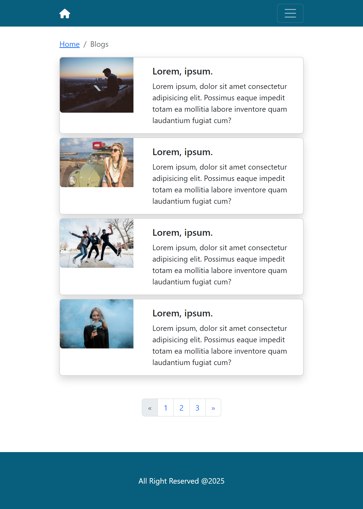
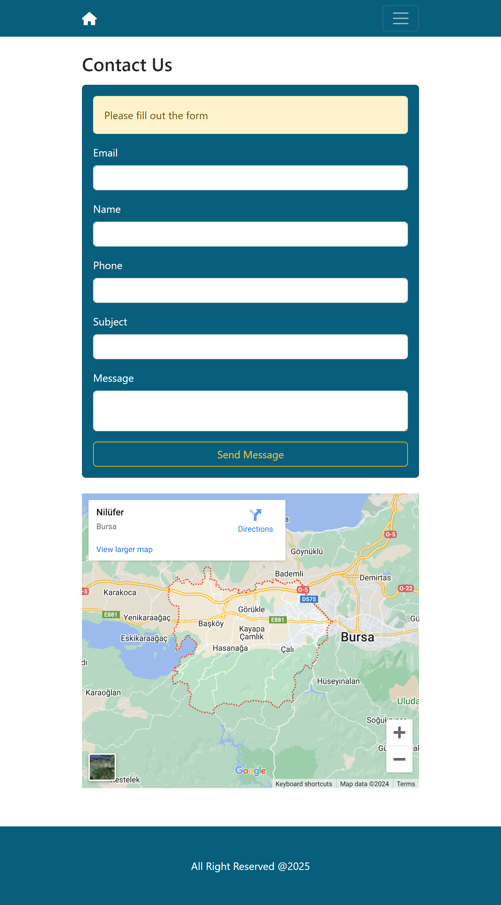
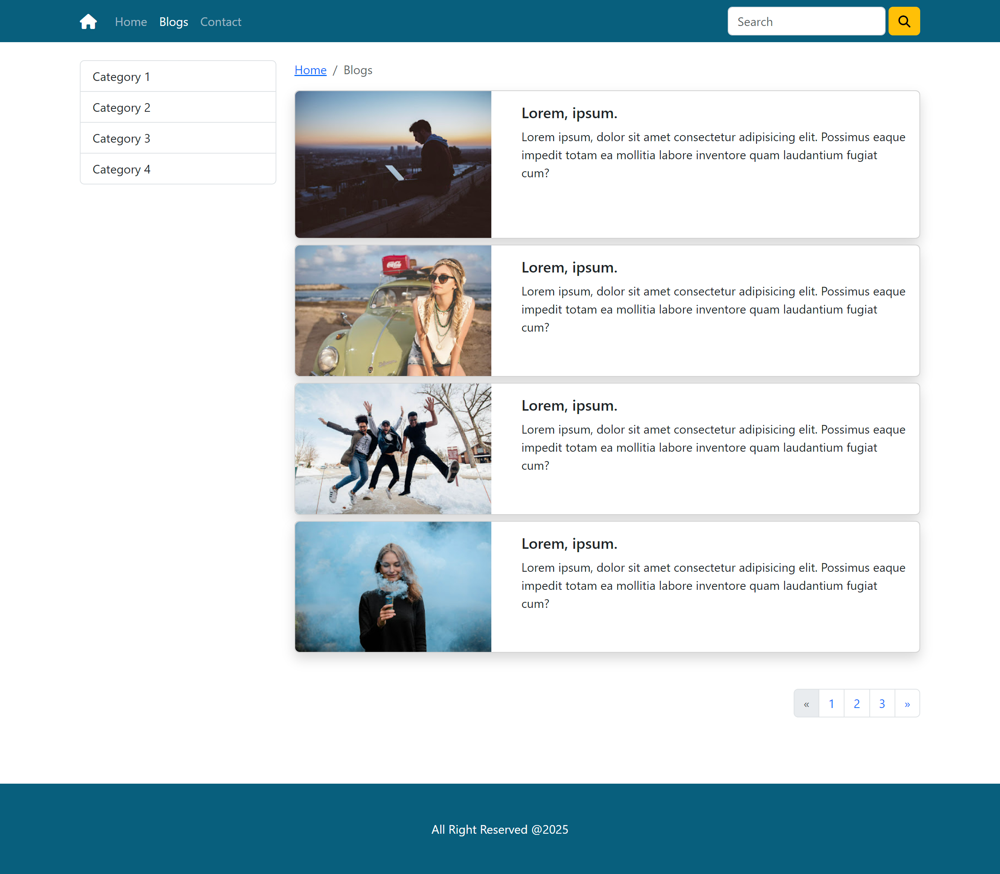
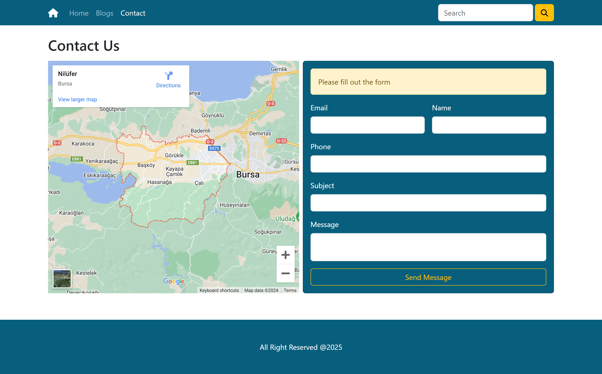

# Blog Page

## This application is a web design application prepared using basic HTML, CSS and Bootstrap.

### Basic structures used on the _HTML_ side:

- [x] Semantic tags (header, main, article, nav)
- [x] Headings
- [x] Paragraphs
- [x] Images
- [x] Links
- [x] Lists and other basic HTML tags.

### Basic structures used on the _CSS_ side:

- [x] CSS
  - [x] Basic CSS Selectors
  - [x] Media queries
- [x] Bootstrap
  - [x] Bootstrap Grid System (Container, Row, and Responsive Columns)
  - [x] Bootstrap Grid and Flexbox Properties (d-grid, d-flex, justify-content-, align-items-)
  - [x] Navigation (navbar and navbar-toggle)
  - [x] Image features (img-fluid, w-100, )
  - [x] List properties (list-group, list-group-item, active)
  - [x] Breadcrumbs
  - [x] Pagination
  - [x] Card (card, card-img-, car-body, card-title, card-text)

### App on small and mobile devices:

#### Home Page

#### Blog Page

#### Contact Page

### App on medium and larger devices:

#### Home Page

#### Blog Page

#### Contact Page

