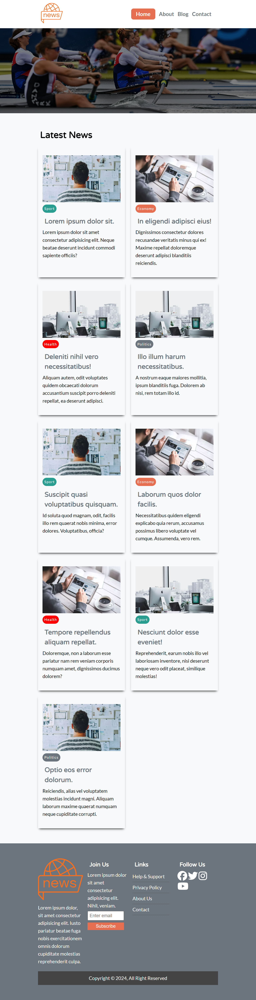

# News Site

## This application is a web design application prepared using basic HTML, CSS and SCSS.

### Basic structures used on the _HTML_ side:

- [x] Semantic tags (header, main, article, nav)
- [x] Headings
- [x] Paragraphs
- [x] Images
- [x] Links
- [x] Lists and other basic HTML tags.

### Basic structures used on the _CSS_ side:

- [x] Box model
- [x] CSS Grid
- [x] CSS Flexbox
- [x] CSS Positions
- [x] Font properties
- [x] Image features
- [x] Media queries
- [x] Different types of selectors (basic to complex)
- [x] SCSS / SASS

### App on mobile devices:


### App on small devices:



### App on medium and larger devices:


### Note: I did minify the CSS files using npm. To do the same on your projects use:

```npm
npm init --yes

install node-sass
```

**Then add the following script in _package.json_ file**

```
"scss": "node-sass -w scss/ -o css/ --output-style compressed"
```
